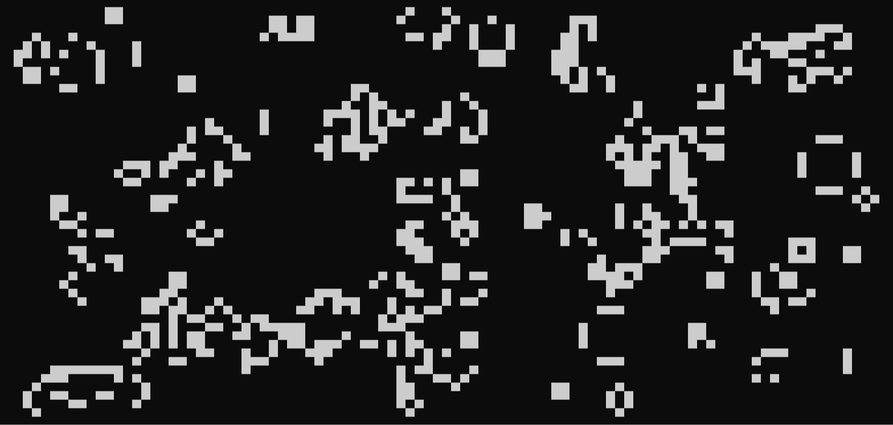

<p align="center">
  
</p>

# Conway's Game of Life in Go

A simple, terminal-based implementation of Conway's Game of Life, written as a learning exercise.

## How to Run
Requires Go to be installed.

1.  Clone the repository:
    ```sh
    git clone https://github.com/FaraamFide/conway-game-go.git
    cd conway-game-go
    ```
2.  Run the simulation:
    ```sh
    go run main.go
    ```
3.  To change the animation speed (ms per frame), use the `-d` or `--duration` flag:
    ```sh
    go run main.go -d 100
    ```

## Configuration
Parameters can be modified directly in the variable block of the `main.go` file.

*   `height`, `width`: Dimensions of the simulation grid.
*   `allocation`: The initial density of living cells (`0.0` to `1.0`). Values between `0.2` and `0.4` usually produce more interesting and long-lasting patterns.
*   `duration`: The default delay in milliseconds between each frame. Can be overridden with a command-line flag.
*   `birth`: A map defining the rules for a dead cell to become alive. The key is the number of living neighbors. Classic rule is `map[int]bool{3: true}`.
*   `alive`: A map defining the rules for a living cell to survive. The key is the number of living neighbors. Classic rule is `map[int]bool{2: true, 3: true}`.

## Technical Notes
*   The grid is stored in a single `[]byte` slice to optimize memory usage.
*   The state of each cell (alive/dead) is represented by a single bit, accessed via bitwise operations.
*   Note: Internal functions use a `(y, x)` coordinate order.
